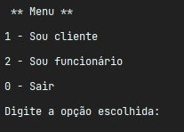

# Exercício de Casa 🏠 

## E-commerce reprograma

A Mayhhara ficou maravilhada pelo seu último trabalho com a lojinha, agora ela consegue gerenciar
os produtos de sua lojinha graças o menu que você criou. Por isso, a May decide pedir a você para criar um outro sistema
dessa vez, esse sistema vai ter um menu para clientes e os clientes poderão:

- Escolher um produto e adicionar ele a um carrinho
- O cliente vai poder escolher um produto pelo seu id, esses produtos são os produtos da LOJA e também escolher a quantidade do produto desejado
- Se o cliente mudar de ideia, ele poderá excluir um produto do carrinho
- O cliente poderá , a qualquer momento , ver o TOTAL dos itens do seu carrinho
- O cliente poderá finalizar a compra. Nesse momento , deve ser gerado um número do pedido e o total da compra. Para assim ele finalizar seu carrinho.

Como você fez o curso da reprograma você sabe exatamente o que fazer.
Agora é hora de ganhar um dinheirinho!
---
### Pro tips:

1. Use o menu da lojinha reprograma e crie um novo menu que será acessado pelos clientes.
Esse menu chamará algumas funções da loja como por exemplo a lista de produtos. Dessa forma o cliente saberá o item deve ser adicionado ao carrinho
2. Você pode criar uma função que será o menu do cliente e outra função com os dois menus ( do cliente e da loja)
EXEMPLO: 

Boa sorte!
---
Terminou o exercício? Dá uma olhada nessa checklist e confere se tá tudo certinho, combinado?!

- [ ] Fiz o fork do repositório.
- [ ] Clonei o fork na minha máquina (`git clone url-do-meu-fork`).
- [ ] Resolvi o exercício.
- [ ] Adicionei as mudanças. (`git add .` para adicionar todos os arquivos, ou `git add nome_do_arquivo` para adicionar um arquivo específico)
- [ ] Commitei a cada mudança significativa ou na finalização do exercício (`git commit -m "Mensagem do commit"`)
- [ ] Pushei os commits na minha branch (`git push origin nome-da-branch`)
- [ ] Criei um Pull Request seguindo as orientaçoes que estao nesse [documento](https://github.com/mflilian/repo-example/blob/main/exercicios/para-casa/instrucoes-pull-request.md).
